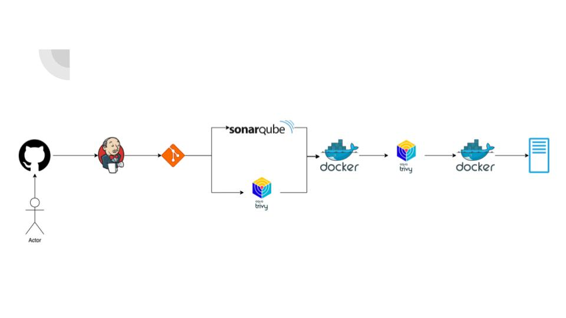

# Laravel CI/CD with Jenkins
This is a simple example of how to use Jenkins to deploy a Laravel application to a server.   



## Table of Contents
- [Requirements](#requirements)
- [Install Jenkins](#Install-jenkins)
- [Setup Laravel Application in Local](#setup-laravel-application-in-local)
- [Install Jenkins, DIND, and SonarQube](#install-jenkins-dind-and-sonarqube)
- [Setup Laravel Pipeline in Jenkins](#setup-laravel-pipeline-in-jenkins)
- [Configure Credentials Container Registry in Jenkins](#configure-credentials-container-registry-in-jenkins)
- [Configure Credentials Server Deployment in Jenkins](#configure-credentials-server-deployment-in-jenkins)
- [Setup SonarQube in Jenkins](#setup-sonarqube-in-jenkins)
- [Setup SonarQube](#setup-sonarqube)
- [Configure Credentials SonarQube in Jenkins](#configure-credentials-sonarqube-in-jenkins)
- [Configure Webhook in GitHub](#configure-webhook-in-github)

## Requirements
- [Jenkins](https://www.jenkins.io/)
- [Laravel](https://laravel.com/)
- [Docker](https://www.docker.com/)
- [Docker Compose](https://docs.docker.com/compose/)
- [Git](https://git-scm.com/)
- [Nginx](https://www.nginx.com/)
- [PHP](https://www.php.net/)
- [Composer](https://getcomposer.org/)
- [Node.js](https://nodejs.org/)
- [NPM](https://www.npmjs.com/)
- [Yarn](https://yarnpkg.com/)
- [MySQL](https://www.mysql.com/)


## Setup Laravel Application in Local
1. Clone this repository
```bash
git clone https://github.com/jawaracloud/laravel-cicd
```
2. Install dependencies
```bash
composer install
npm install
```
3. Create .env file and configure the database
```bash
cp .env.example .env
```
4. Generate application key
```bash
php artisan key:generate
```
5. Running Docker Compose MySQL
```bash
docker compose -f mysql-docker-compose.yml up -d
```
6. Running Laravel Migration
```bash
php artisan migrate
```
7. Running Laravel Seed
```bash
php artisan db:seed
```
8. Running Laravel Application
```bash
php artisan serve
```
9. Create filament user
```bash
php artisan filament:user
```
10. Login to Laravel Application
Open browser and go to http://localhost:8000/admin
email: admin@laravel.com
password: 123

## Install Jenkins, DIND, and SonarQube
1. Clone this repository
```bash
git clone https://github.com/jawaracloud/jenkins-casc
```
2. Run docker-compose
```bash
docker compose up -d
```
3. Login to Jenkins http://localhost:8080
username: admin
password: nimda
4. Login to SonarQube http://localhost:9000
username: admin
password: admin

## Setup Laravel Pipeline in Jenkins
1. Create a new item
2. Choose Pipeline
3. Configure the pipeline
4. Enter name item: laravel-cicd
5. Enter description: Laravel CI/CD
6. Checklist: GitHub Hook Trigger for GITScm polling for Automatic Build when push to GitHub
7. Set Pipeline definition: Pipeline script from SCM
8. SCM: Git
9. Set Repository URL use SSH or HTTPS ( This is base on your repository credential )
10. Set Credentials, we can use username and password or SSH key. If you use SSH key, you must add the Private SSH key to the Jenkins credential. If you use username and password, you must add the username and password to the Jenkins credential.
11. Click advanced and set the Refspec: `+refs/tags/*:refs/remotes/origin/tags/*`. This is to fetch the tag from the repository.
12. Set Branch Specifier: `*/main`. This is to fetch the main branch from the repository.
13. Add Additional Behaviours and Choose Advanced clone behaviours, set the shallow clone depth to 1 and checklist the Fetch tags, the goal is to fetch the latest tag from the repository.
14. Set Script Path: Jenkinsfile
15. Checklist Lightweight checkout
16. Save

## Configure Credentials Container Registry in Jenkins
1. Configure Container Registry Credentials
2. Go to Jenkins > Manage Jenkins > Manage Credentials
3. Click on the global domain
4. Click Add Credentials
5. Choose Kind: Username with password
6. Set the username and password for the container registry
7. Set credentials ID: container_registry
8. Click OK

## Configure Credentials Server Deployment in Jenkins
1. Configure Server Deployment Credentials
2. Go to Jenkins > Manage Jenkins > Manage Credentials
3. Click on the global domain
4. Click Add Credentials
5. Choose Kind: SSH Username with private key
6. Set the username and private key for the server deployment
7. Set credentials ID: server_deployment
8. Click OK

## Setup SonarQube in Jenkins
1. Go to Jenkins > Manage Jenkins > System Configuration > System
2. Scroll down to the SonarQube servers section
3. Click on Add SonarQube
4. Check the Enable injection of SonarQube server configuration as build environment variables
5. Set the Name: SonarQube
6. Set the Server URL: http://sonarqube:9000
7. Set the Server authentication token: sonarqube
8. Click Save

## Setup SonarQube
1. Go to SonarQube http://localhost:9000
2. Login with username: admin and password: admin
3. Click create new project choose manualy and set the project key, name, and branch
4. Generate the token and copy the token and save it

## Configure Credentials SonarQube in Jenkins
1. Configure SonarQube Credentials
2. Go to Jenkins > Manage Jenkins > Manage Credentials
3. Click on the global domain
4. Click Add Credentials
5. Choose Kind: Secret text
6. Set the secret text for the SonarQube token
7. Set credentials ID: sonarqube
8. Click OK

## Configure Webhook in GitHub
1. Go to GitHub
2. Go to the repository
3. Go to Settings
4. Go to Webhooks
5. Click Add webhook
6. Set the Payload URL: http://jenkins:8080/github-webhook/ or if use public IP or domain set the Payload URL: http://your-ip-or-domain:8080/github-webhook/
7. Set the Content type: application/json
8. Set the Secret: leave it blank
9. Set the SSL verification: check if you use SSL
10. Set the Which events would you like to trigger this webhook?: Let me select individual events, checklist Pushes and Branch or tag creation.
11. Click Add webhook

## Configure SSH Key in Jenkins
1. Go to Jenkins > Manage Jenkins > Manage Credentials
2. Click on the global domain
3. Click Add Credentials
4. Choose Kind: SSH Username with private key, you can create a new key or use an existing key: `ssh-keygen -t rsa -b 4096 -C -m PEM -f ~/.ssh/jenkins_key`
5. Set the username and private key for the server deployment
6. Set credentials ID: server_deployment
7. Click Add Credentials ( For IP or Domain Server Deployment )
8. Choose Secret Text
9. Set the secret text for the server deployment IP or Domain
10. Set credentials ID: ip_server_deployment
11. Click OK

## Test the Pipeline
1. Clone the repository
2. Create some changes
3. Push the changes to the repository with the tag
4. Check the Jenkins pipeline
5. Check the SonarQube
6. Check the Docker Container Registry
7. Check the Server Deployment
